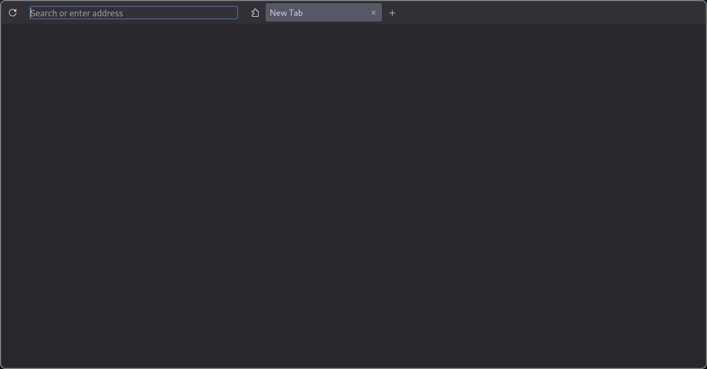
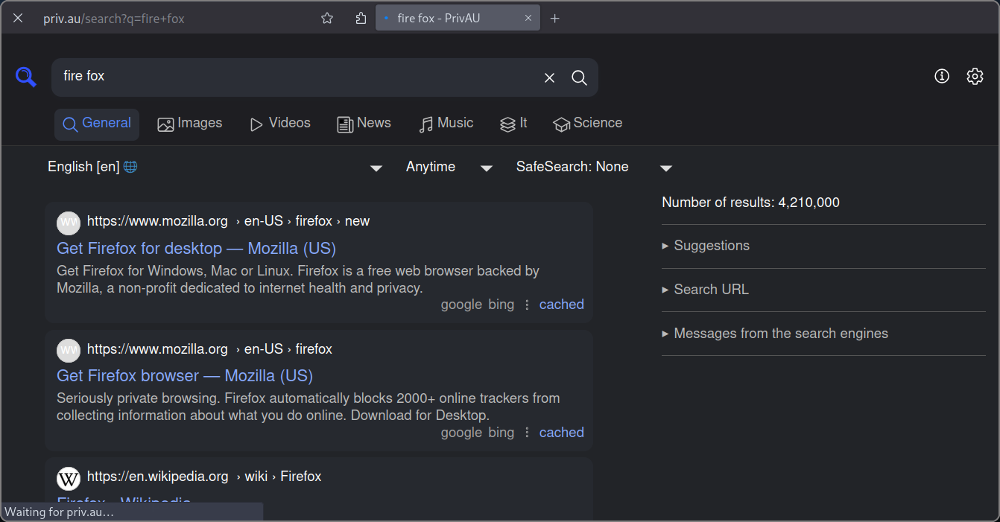

<!-- 

 -->

        
        
    

## userChrome.css

A Firefox stylesheet designed to be mouse-only but not too complicated. Look, I love my keyboard shortcuts just as much as the next person, but there are instances when using the mouse to navigate the browser is more handy.

This theme might not function somewhere else; it has only been tested on my particular configuration. In any case, please submit an issue or pull request if you try it and encounter any problems.

## Installation

From your `about:config` enable the `toolkit.legacyUserProfileCustomizations.stylesheets` option. Next, open the folder containing your profile (you can locate it in `about:profiles`. Paste the `user.js` file inside, create the folder `chrome`, and add the `userChrome.css` and `userContent.css` files.

Any theme should work. however, this theme is designed to be used with the Compact density (enabled with the option `browser.compactmode.show` in `about:config` and Firefox's default Dark theme (not the System theme).

## Other Steps

Hear are some other steps that you can take to make you browser more like mine 

- Custmize your settings
- Set your `browser.tabs.tabMinWidth` in `about:config`
- Set the zoom level of your devloper options by `devtools.toolbox.zoomValue`
- Find a good search engine to use. I use [Serx-Singapore](http://priv.au) & My [Preferences-URL](https://priv.au/preferences?preferences=eJx1WMuO67gR_Zp4I4yRZAIMsvAqQLYTILMXKLIs1RXJ0uXDtvrrp6iHVbR6Fm2Yh2aRrMepw9YqQU8BId568BCUvVjl-6x6uIG_WNLKLt9UTqTJTRYS3Hqi3sLlrh6oybcBItkHhB1Hx8vbKdBrvv0RMlwcpIHM7X-___-PS1R3iKCCHm5_v6QBHNwiFrsXNpNtii1b9PBsk-pu_1U2wsUQHnuQ4uGVQn9Zl7UxzXxEo8J40eAThFZZ7L3j7-vuyjyU12DabdvV6M8MYW7RtwkTr19-if6OHhPb1IGsXcF1VTmVXp01syELerM-UBphjjcDd8XHvxiMqrO8G_gePfv1373q25b4quFv__yPshOjjUWfX82k9Miuim2Lqcx5r2JTdsMHiCXT2DgMgYLE-OoNfzYxUZA_9opDYtRuMiTU_L1EJJZxHNt2izQPO-WNVm5qW5cj6oKgxfLXtg80QHGBfN-sFoSlBeU4MVY-d2RdVa1OXdYjpO1E3dRVJ0gGe-EfmsBzmCOIrRwYVFet9dWAsKwtZXO3KoBCaVJPU4A7BOCgb5tyOGNksOXIYsFX7GkeyJkm1s4wfQzPNy9gdXGdg0WojpBD2X6WmAH44uR8e9pATCphPO5u4IHKJ46Z2M2YvuHcKnmJ5KO0WHZgJ2wJKif4amgOw08c0aikquNwUMpfT9-j53uLuVOUxVzlGoE_QZXjfOawU5NwATj6gVOJ94ElLpi5cu8_XuJY7BqTBpUcU4mELeoxSCAANJHu6ckZ0xgMXMKlmNcMuQf0IypZK_d5Fj7sAb8GZg6JeMzxCKgmAx2EfrPYM5Fw1pLbx0SGU9VICwtfNpNVc6nlv5hxxFkqne2YhwIq2xT2lREaVBdU-di2HJhfIKwBWQF4vSuCjcQr0j6zbLgN0JnuOAu6PktHolfiMOj5K1KO32O7c35gHOiwySQTVJibEtMoa2CfoHvDl-uZ9uUFyyykoHy0fHyZEkyo_aNKcEtdTHAN-925CSk9Kb8P8bUQyHFER19DRSTu6TorAT_twfSzEhlKZo4gqamwmOIMm3LHaai2yj24p8zzeYBq4uMFJHyxtgeMO3Vy5-DAQ5T0MJVqETsv4-typeNmzIdnkniD50o_pvZC_25ZVeh8U2bnx3bSn0_mMblqAeoVK3Tae4VPBBMUJ1TTMbFFSaIBjMF0uCxgP6TGqIrUAqXEaoC4bgiEf9d7uDlinUsRJlS7ww6Kw6hzjNdpZjGzZ5FWxsylyF1mgp7fgfplIAsnfLVZeKIpH2_U8ZVRN1HzKhVkosTSDaYip8T5Eo0zJeKCGks6v3myeJBtqFz9WKCb51NV3tlHppk4yA6nmA6qPliAD2ZXaGdHJbWFkx7oSlK_x0_sqiZYOlFHNMZPsLJdgJ-Z6qgUMFIO-oxOoBeG_Av4cGeBi7pYQlL_-kHzh5sLWiLItXs9pamcPCXrk-w9KMdab6h7Lur0Rb7uZb_--ttLaIBswMsU_fLKVaREPwDGM3KupA2vPLv0kgktiZrx6lFKStRL7uYe3E6cE0BIuZP8tigyXj4W_fSETkzNqpY9ZXw-W8hMrdKi5bhEJjyo3PjCkTzzShNnT352ID0DY6gvt0KnvVb4FKT4Y7pOT-lrbiy6Yq346AslC1sPQrNo9803T2XtwP7zH6nhWK9VXsjO2fnYi5vcA86Js8LVpbjlHT1szf8hp0NTVNw89teedh6-cA-qXiILa68vj3LG9xPhhY_PItkkmNDp3F8rhTvAfaRCkO_MpSI2miF3m2FIzA-e9xNRu5tAWKkq5uVdg7Bisqo7BoepflMnx_6bQDoFe8MrF27Yydsb_g3tcm2PKkpZAs7Nzc7nCKepzG3pBHI3T98a4VsL_OuXTfUckFP8rjPkP-2-8YEZm6ldTpm3tFEsZWEXgbsWKQ-ACOmkQzjtARLLcCE8TKn242cTP3JJVMqERT12Shx4In5IRpbqBgSbsSpwRZ4IU_OERzLz67PWYNzv9EjMR3dLzz1B45i77FPe1WlRQZ7V3PpQ_q5r5glCjm8XRLJoWOyH2u8z5Q9eeyP7ebgWSoerYiOpX2VTJLT4-XvqjlamiWP2cvzeaN7y1VTNhoLxOIpuTpTK00a-mJ4phSv6DxqpynQhkPNjPf1rf2Mf_6CYbGZeiLeiSl7XbXQdOGe55WzMKWdItet_Yp6BBdNpmv3bMivo8c0732-gldWZ70_hZKIk9bbqNBfB3lv0dzpvHJZnTsuvcD6cK9lz-k2p2pYfFDzHyXNhBcWJf_sTpC8vpw==)
- Set The minimum font size form firefox settings
- Hide/custmize your toolbar
- Install extensions like `uBlock Origin`
- Import other things like your `Bookmarks` and `Passwords` 

## Credits

Based on [Eric murphy](https://github.com/ericmurphyxyz/userChrome.css.git) and [Betterfox](https://github.com/yokoffing/Betterfox), with additional lines [My-self](https://github.com/akritbehera27)
